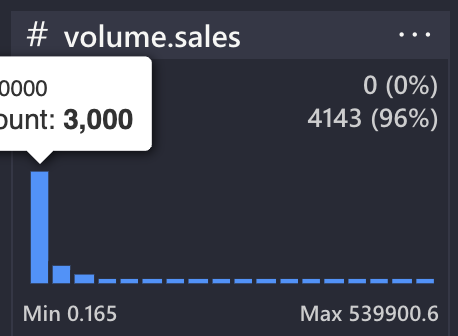
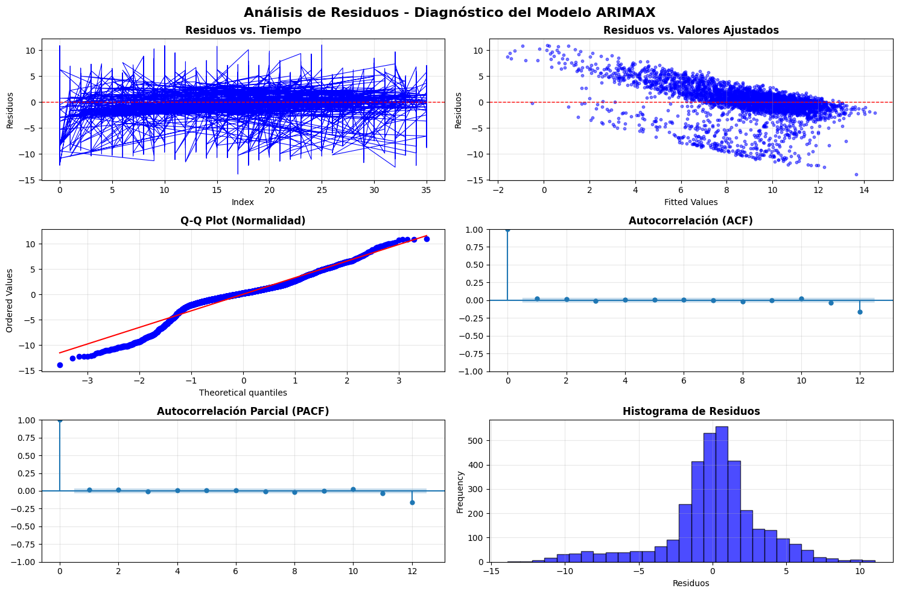
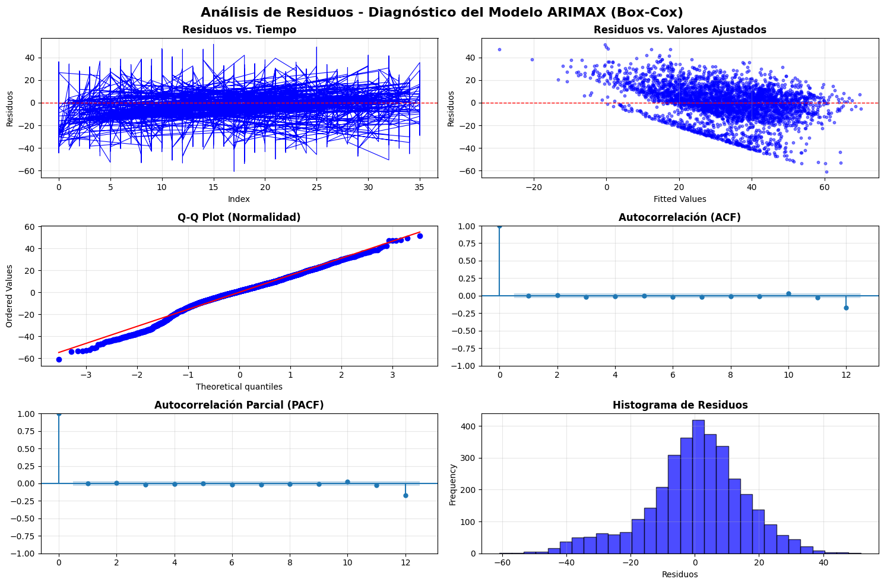

Steps:

1. Utilizar las brands principales, el resto descartarlas. Osea solo nos quedamos con 3 brands.
2. Hacemos un modelo global para todas las brands. Y convertimos la brand en una dummy.
3. Modelización de todas las variables, pero solo interacciones entre dummy brand y price (solo hasta orden 2)
4. Si es necesario utilizar la transformación para variable objetivo

El histograma de `volume.sales` es:

#### Residues Analysis (White Noise)

**Modelo 1**

[Heteroscedasticity Test] ARCH p-value: 0.7866304443672794 -- range(> 0.05)
[Normality Test] Jarque-Bera p-value: 0.0 -- range(> 0.05)
[Normality Test] Shapiro-Wilk p-value: 3.6428686938828743e-38 -- range(> 0.05)
[Autocorrelation Test] Ljung-Box p-value:
lb_stat lb_pvalue
10 30.858273 0.000619 -- range(> 0.05)
[Autocorrelation Test first order] Durbin-Watson statistic: 1.9956413463947142 -- range(2.0)

---

**Modelo 2 (con tranformación logarítmica)**

Residues Analysis (White Noise)

[Heteroscedasticity Test] ARCH p-value: 0.8760245563485528 -- range(> 0.05)
[Normality Test] Jarque-Bera p-value: 1.4548666245845683e-178 -- range(> 0.05)
[Normality Test] Shapiro-Wilk p-value: 7.04853588743164e-36 -- range(> 0.05)
[Autocorrelation Test] Ljung-Box p-value:
lb_stat lb_pvalue
10 6.167492 0.801 -- range(> 0.05)
[Autocorrelation Test first order] Durbin-Watson statistic: 1.958625498564637 -- range(2.0)

---

**Modelo 2 (con tranformación Box-Cox)**

Residues Analysis (White Noise) - Box-Cox

[Heteroscedasticity Test] ARCH p-value: 0.7034787992778437 -- range(> 0.05)
[Normality Test] Jarque-Bera p-value: 7.925822199046298e-38 -- range(> 0.05)
[Normality Test] Shapiro-Wilk p-value: 1.6452917342222447e-20 -- range(> 0.05)
[Autocorrelation Test] Ljung-Box p-value:
lb_stat lb_pvalue
10 6.921181 0.732864 -- range(> 0.05)
[Autocorrelation Test first order] Durbin-Watson statistic: 2.0073103032585897 -- range(2.0)

---

#### TASKS extra:

He probado a Tratar outliers y meter dummies de acontecimiento en ARIMAX. Pero he visto que no tiene significancia para el modelo. Y no lo incluyo.
